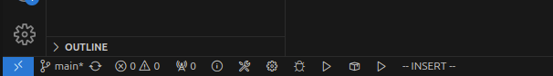

# Env Setup Guide

Make sure you are using Ubuntu x64 22/23.

Other operating systems are not supported yet.

## 1. Install gcc and g++

Install build essentials:

```bash
sudo apt-get install build-essential
```

Check gcc version:

```bash
gcc -v
```

If you are using ubuntu 23, the output would imply that the installed gcc version is "13.x.x". Then everything is okay.

---

However, if you are using ubuntu releases lower than 23, you will have to install gcc-13 and g++-13 mannualy.

First check which version of gcc and g++ is installed on your system:

```bash
gcc -v
```

**Suppose** that your currently installed gcc and g++ version is 11, you should find gcc-11 and g++-11 under "/usr/bin/":

```bash
ls /usr/bin
# All files under "/usr/bin" would be listd.
```

Now, install gcc-13 and g++-13, while keeping older version existed:

```bash
# Install gcc-13 and g++-13
sudo add-apt-repository ppa:ubuntu-toolchain-r/test
sudo apt-get update
sudo apt-get install gcc-13 g++-13

# Register gcc-11 and g++-11 as one group of alternatives
sudo update-alternatives --install /usr/bin/gcc gcc /usr/bin/gcc-11 110 --slave /usr/bin/g++ g++ /usr/bin/g++-11

# Register gcc-13 and g++-13 as another group of alternatives
sudo update-alternatives --install /usr/bin/gcc gcc /usr/bin/gcc-13 130 --slave /usr/bin/g++ g++ /usr/bin/g++-13

# Pop a prompt to select the default version of gcc, and g++ would be updated automatically
sudo update-alternatives --config gcc
```

For general purpose of C++ programing, it is suggested that gcc-11 and g++-11 is installed on your system. Some softwares may have a strict rule for gcc version not larger than 12.

## 2. Install CMake

```bash
sudo apt-get install cmake
```

## 3. \[Optional\] Install VSCode

```bash
sudo snap install code --classic
```

Install C/C++ Extension Pack provided by Microsoft. This should include C/C++ extension and CMake Tools extionsion.

You should be able to build, run and debug the project with the buttons on the status bar on the left-bottom of the window.

</img>